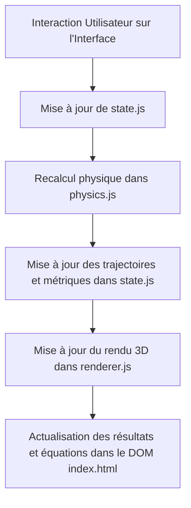

# Gravity3D — Simulateur de Mouvement Parabolique 3D

**Gravity3D** est une application web interactive de simulation physique en 3D permettant de visualiser, d'analyser et de résoudre le mouvement parabolique de projectiles sous l'influence de la gravité et de la résistance de l'air. Développée en JavaScript moderne avec Three.js et Vite, elle offre une expérience immersive et rigoureuse adaptée aux étudiants, enseignants et passionnés de physique.

---

## 🚀 Fonctionnalités Clés

*   **Deux Modes de Fonctionnement :**
    *   **Simulation :** Paramétrage complet des conditions initiales (vitesse initiale $v_0$, angle d'élévation $\alpha$, angle de déviation latérale $\beta$, position de départ $x_0, y_0, z_0$, hauteur d'arrivée) pour observer la trajectoire en temps réel.
    *   **Cible :** Résolution géométrique et physique pour atteindre une cible en 3D $(X, Y, Z)$ à une vitesse de tir donnée, affichant jusqu'à deux trajectoires possibles (tir tendu et tir en cloche).
*   **Modélisation Physique Avancée :**
    *   Calcul analytique exact pour les trajectoires idéales sans frottement.
    *   Intégration numérique en temps réel (méthode d'Euler avec pas de temps $dt = 0{,}01\text{ s}$) pour la résistance de l'air (modèles linéaire et quadratique).
    *   Paramètres ajustables pour la masse du projectile, son rayon, la masse volumique de l'air et sa forme géométrique (présélections pour sphère, cylindre, balle de fusil ou saisie d'un coefficient personnalisé).
*   **Rendu et Visualisation Interactive 3D :**
    *   Scène 3D interactive utilisant **Three.js** avec caméra orbitale (OrbitControls) et boutons d'orientation rapide (vues de dessus, de gauche, de droite et perspective isométrique).
    *   Repères cartésiens volumétriques mondiaux (Global : axes X, Y, Z) et repère local (axes $x'$, $y'$, $z$) aligné sur le plan de tir.
    *   Représentation dynamique en temps réel du vecteur vitesse instantané et de ses composantes projetées ($v_x$, $v_y$, $v_z$).
    *   Tracé de la parabole de sûreté (enveloppe limite de portée) et affichage dynamique de l'équation mathématique du mouvement $z(x')$.
*   **Interface Premium & Ergonomique :**
    *   Synchronisation bidirectionnelle fluide entre les curseurs (sliders) et les champs de saisie numérique.
    *   Thèmes clair et sombre persistants, gérés dynamiquement par CSS et LocalStorage.
    *   Panneau de contrôle rétractable (style menu latéral) et raccourcis clavier intuitifs (Espace pour pause/lecture, Échap pour réinitialiser la simulation).

---

## 🛠️ Stack Technique

*   **Rendu 3D :** [Three.js](https://threejs.org/) (v0.158.0)
*   **Serveur & Outil de Build :** [Vite](https://vite.dev/) (v6.0.0)
*   **Langages :** HTML5, JavaScript Moderne (ES6+), CSS3 Vanilla (variables CSS pour la gestion des thèmes)
*   **Contrôle de Caméra :** OrbitControls de Three.js

---

## 📋 Prérequis

*   **Node.js :** Version 18.0.0 ou supérieure recommandée.
*   **Gestionnaire de paquets :** `npm` (installé par défaut avec Node.js).
*   Un navigateur internet moderne prenant en charge **WebGL** (Chrome, Firefox, Safari, Edge).

---

## 🏁 Guide de Démarrage (Local)

### 1. Clonage du Projet
```bash
git clone <url-du-depot>
cd Gravity3D
```

### 2. Installation des Dépendances
Installez les packages listés dans le fichier `package.json` :
```bash
npm install
```

### 3. Lancement du Serveur de Développement
Pour lancer l'application localement avec rechargement à chaud (Hot Module Replacement) :
```bash
npm run dev
```
Ouvrez ensuite votre navigateur à l'adresse locale indiquée dans votre terminal (généralement `http://localhost:5173`).

### 4. Compilation pour la Production
Pour compiler et minifier le projet en vue d'un déploiement :
```bash
npm run build
```
Les fichiers générés et optimisés seront créés dans le dossier `/dist`.

---

## 📐 Architecture du Projet

Le codebase est organisé de manière simple et modulaire :

```
Gravity3D/
├── dist/                  # Fichiers compilés pour la production
├── public/                # Ressources publiques statiques
├── src/
│   ├── main.js            # Initialisation du DOM, liaison des boutons et boucle d'animation
│   ├── physics.js         # Moteur physique (modèles analytique, Euler, frottement, enveloppe)
│   ├── renderer.js        # Configuration de la scène 3D Three.js, lumières, repères et objets
│   ├── state.js           # Stockage de l'état global et réactif de la simulation
│   └── style.css          # Design global, transitions fluides et variables de thème
├── index.html             # Point d'entrée HTML5 de l'application
├── package.json           # Dépendances et scripts npm
└── vite.config.js         # Configuration pour le serveur de développement Vite
```

### Flux de Données et Cycle de Mise à Jour


---

## 🧪 Tests

Ce projet ne contient pas actuellement de tests unitaires automatisés. Les validations fonctionnelles et physiques sont réalisées de manière manuelle :
*   **Validation Physique :** Comparaison des résultats de la simulation sans frottement avec les équations théoriques du mouvement parabolique uniforme (portée maximale, hauteur maximale du sommet, temps de vol).
*   **Précision Numérique :** Suivi de la trajectoire avec frottement et observation de la stabilité de la méthode d'intégration numérique d'Euler ($dt = 0{,}01\text{ s}$).
*   **Compatibilité Web :** Tests de fluidité du canvas WebGL et de la responsivité de l'interface sur divers terminaux et tailles d'écran.

---

## 🌐 Déploiement

L'application produit des fichiers entièrement statiques lors du build. Elle peut être hébergée facilement sur n'importe quel hébergeur de sites statiques :

*   **Vercel :** Liaison directe avec le dépôt GitHub ou en installant le CLI (`npm i -g vercel`) puis en exécutant la commande `vercel` à la racine.
*   **Netlify :** Glisser-déposer du dossier `/dist` ou build automatique via Git.
*   **GitHub Pages :** Publication de la branche de build ou utilisation d'une action GitHub CI/CD pour déployer le dossier `/dist`.

---

## 🔍 Dépannage (Troubleshooting)

*   **Le Canvas 3D reste noir ou ne s'affiche pas :**
    *   Vérifiez que votre navigateur prend en charge WebGL en visitant [WebGL Report](https://webglreport.com/).
    *   Assurez-vous que l'accélération matérielle est activée dans les paramètres de votre navigateur.
*   **Les sliders et les champs de texte numérique ne s'actualisent pas :**
    *   Cliquez sur le bouton **Reset** de l'interface pour recharger proprement l'application.
*   **Le projectile traverse le sol ou disparaît :**
    *   La trajectoire s'interrompt dès que la hauteur descend sous la valeur de **Hauteur arrivée**. Assurez-vous que la hauteur initiale $z_0$ et la hauteur d'arrivée soient logiquement coordonnées.
